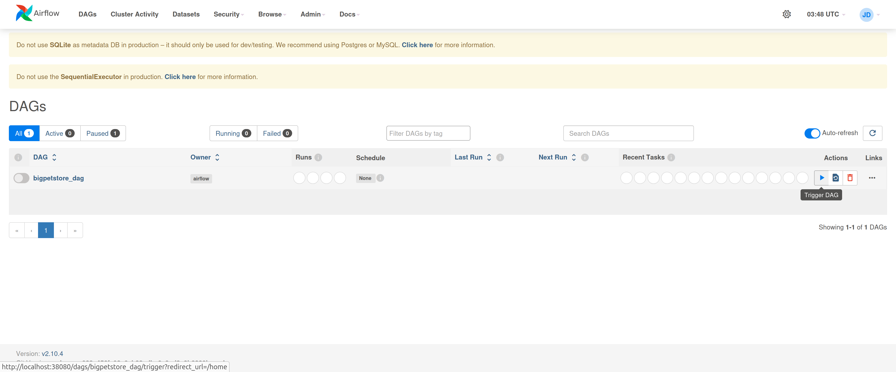
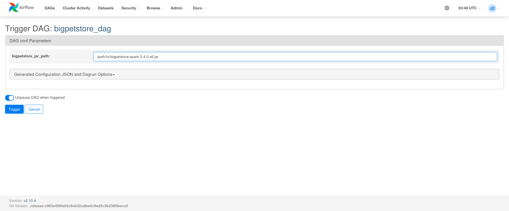
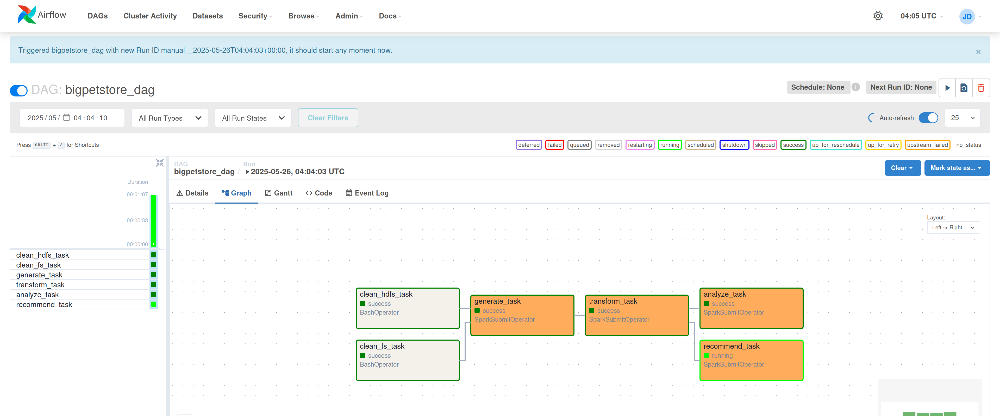

<!--
  Licensed to the Apache Software Foundation (ASF) under one or more
  contributor license agreements.  See the NOTICE file distributed with
  this work for additional information regarding copyright ownership.
  The ASF licenses this file to You under the Apache License, Version 2.0
  (the "License"); you may not use this file except in compliance with
  the License.  You may obtain a copy of the License at

       http://www.apache.org/licenses/LICENSE-2.0

  Unless required by applicable law or agreed to in writing, software
  distributed under the License is distributed on an "AS IS" BASIS,
  WITHOUT WARRANTIES OR CONDITIONS OF ANY KIND, either express or implied.
  See the License for the specific language governing permissions and
  limitations under the License.
-->
BigPetStore -- Spark
====================

BigPetStore is a family of example applications for the Hadoop and Spark
ecosystems. BigPetStore is build around a fictional chain pet stores,
providing generators for synthetic transaction data and pipelines for
processing that data. Each ecosystem has its own version of the
application.

The Spark application currently builds against Spark 3.5.4.

Architecture
------------
The Spark application consists of the following modules so far:

* generator: generates raw data on the dfs
* datamodel: data model used as input for analytics components
* etl: normalizes and transforms the raw data to the data model

Data Model
----------

The data generator creates a dirty CSV file containing the following fields:

* Store ID: Int
* Store Zipcode: String
* Store City: String
* Store State: String
* Customer ID: Int
* Customer First Name: String
* Customer Last Name: String
* Customer Zipcode: String
* Customer City: String
* Customer State: String
* Transaction ID: Int
* Transaction Date Time: String (e.g., "Tue Nov 03 01:08:11 EST 2014")
* Transaction Product: String (e.g., "category=dry cat food;brand=Feisty Feline;flavor=Chicken & Rice;size=14.0;per_unit_cost=2.14;")

Note that the transaction ID is unique only per customer -- the customer and transaction IDs form a unique composite key.

Since the dirty CSV data contains repetitive information and requires massaging to use for analytics, an
internal structured data model is defined as input for the analytics components:

* Location(zipcode: String, city: String, state: String)
* Customer(customerId: Long, firstName: String, lastName: String, zipcode: String)
* Store(storeId: Long, zipcode: String)
* Product(productId: Long, category: String, attributes: Map[String, String])
* Transaction(customerId: Long, transactionId: Long, storeId: Long, dateTime: java.util.Calendar, productId: Long)

The ETL stage parses and cleans up the dirty CSV and writes out DataFrames for each data type in the data model as
Parquet files. The analytics components can use the `IOUtils.load()` method to de-serialize the structured data.

Running Tests
-------------
BigPetStore Spark includes unit tests that you can run with the following command:

```
gradle clean test
```

Building and Running with Spark
-------------------------------
BigPetStore has a Spark driver for generating data with the new data generator.
Build a fat jar as follows:

```
gradle clean shadowJar
```

This will produce a jar file under `build/libs` (referred to as `bigpetstore-spark-X.jar`). You can then
use this jar to run a Spark job as follows:

```
spark-submit --master local[2] --class org.apache.bigtop.bigpetstore.spark.generator.SparkDriver bigpetstore-spark-X.jar generated_data/ 10 1000 365.0 345
```

You will need to change the master if you want to run on a cluster. The last five parameters control the output directory,
the number of stores, the number of customers, simulation length (in days), and the random seed (which is optional).


Running the ETL component
-------------------------
The data produced by the generator is in a raw text format, similar to what users will see in production environments.
The raw data isn't normalized (e.g., repeated customer, store, location, and product information) and needs to be parsed
(e.g., dates) before it can be easily used.  The ETL component does this for us.

The ETL component:

* Reads the raw data
* Parses the data times and products
* Normalizes the data
* Writes out DataFrames for each type of class (Store, Customer, Location, Product, Transaction) in the data model

After building the jar (see above), you can run the ETL component like so:

```
spark-submit --master local[2] --class org.apache.bigtop.bigpetstore.spark.etl.SparkETL bigpetstore-spark-X.jar generated_data transformed_data
```

Running the SparkSQL component
-------------------------------

Once ETL'd we can now process the data and do analytics on it. The DataModel.scala class itself is used to read/write classes
from files. To run the analytics job, which outputs a JSON file at the end, you now will run the following:

```
spark-submit --master local[2] --class org.apache.bigtop.bigpetstore.spark.analytics.PetStoreStatistics bigpetstore-spark-X.jar transformed_data PetStoreStats.json
```

Current queries include:

1. Total Transactions
2. Transaction Counts by Month
3. Transaction Counts by Product
4. Transaction Counts by Product and Store Zipcode

This will output a JSON file to the current directory, which has formatting (approximately) like this.

```
{
   "totalTransaction":34586,
   "transactionsByZip":[
   {"count":64,"productId":54,"zipcode":"94583"},{"count":38,"productId":18,"zipcode":"34761"},
   {"count":158,"productId":14,"zipcode":"11368"},{"count":66,"productId":46,"zipcode":"33027"},
   {"count":52,"productId":27,"zipcode":"94583"},{"count":84,"productId":19,"zipcode":"33027"},
   {"count":143,"productId":0,"zipcode":"94583"},{"count":58,"productId":41,"zipcode":"72715"},
   {"count":76,"productId":54,"zipcode":"15014"},{"count":118,"productId":52,"zipcode":"45439"}},
     ..... (several more) ....
   "productDetails":[
      {
         "productId":0,
         "category":"kitty litter",
         "attributes":{
            "category":"kitty litter",
            "brand":"Pretty Cat",
            "size":"7.0",
            "per_unit_cost":"1.43"
         }
      },
      {
         "productId":2,
         "category":"dry cat food",
         "attributes":{
```

Of course, the above data is for a front end web app which will display charts/summary stats of the transactions.
Keep tracking Apache BigTop for updates on this front!

Running the Product Recommendation Component
--------------------------------------------

BigPetStore can recommend products to customers using the alternating least squares (ALS) algorithm. The recommender can be run as follows:

```
spark-submit --master local[2] --class org.apache.bigtop.bigpetstore.spark.analytics.RecommendProducts bigpetstore-spark-X.jar transformed_data recommendations.json
```

The resulting json file will contain lists of customers, products, and products recommended to each customer.

Airflow Integration
--------------------------------------------

The steps described above are consolidated into [a single Airflow DAG](../../bigtop-deploy/puppet/modules/airflow/templates/example_bigpetstore.py).
You can try it as follows. The example here is tested on Debian 12, and assuming [Puppet](../../bigtop_toolchain/bin/puppetize.sh) and [Bigtop toolchain](../../bigtop_toolchain/README.md) are already installed and BPS Spark is built as a shadowed JAR in accordance with [the guide above](#building-and-running-with-spark).

1. (Optional) build Airflow and Spark including their dependencies.
   You can skip it if you use Bigtop's binary distribution packages on its public repository.

```
$ ./gradlew allclean airflow-pkg spark-pkg repo -Dbuildwithdeps=true
```

2. Deploy the packages above though Bigtop's Puppet manifests with appropriate parameters:

```
$ cat bigtop-deploy/puppet/hieradata/site.yaml
bigtop::bigtop_repo_gpg_check: false
bigtop::bigtop_repo_uri: [...]
bigtop::hadoop_head_node: ...
hadoop::hadoop_storage_dirs: [/data]
hadoop_cluster_node::cluster_components: [bigtop-utils, hdfs, yarn, spark, airflow]
airflow::server::install_bigpetstore_example: true  # Enable the BigPetStore DAG
airflow::server::load_examples: false  # Disable Airflow's default examples for simplicity
$ sudo cp -r bigtop-deploy/puppet/hiera* /etc/puppet
$ sudo puppet apply --hiera_config=/etc/puppet/hiera.yaml --modulepath=/vagrant_data/bigtop/bigtop-deploy/puppet/modules:/etc/puppet/code/modules:/usr/share/puppet/modules /vagrant_data/bigtop/bigtop-deploy/puppet/manifests
```

3. Create output directories on HDFS with the airflow owner:

```
$ sudo -u hdfs hdfs dfs -mkdir /user/airflow
$ sudo -u hdfs hdfs dfs -chown airflow:airflow /user/airflow
```

4. Login Airflow's web UI with admin/admin and wait for the DAG picked up for a while.
   Once it's found, you can run it through the triangle button on the right.
   

5. Trigger the DAG with the path to the BPS Spark JAR.
   

6. If settings are appropriate, the BPS DAG should successfully run as follows:
   
