# Kerberos Ambari wizard

> Make sure your service is up and running

### 1. Enabled Kerberos
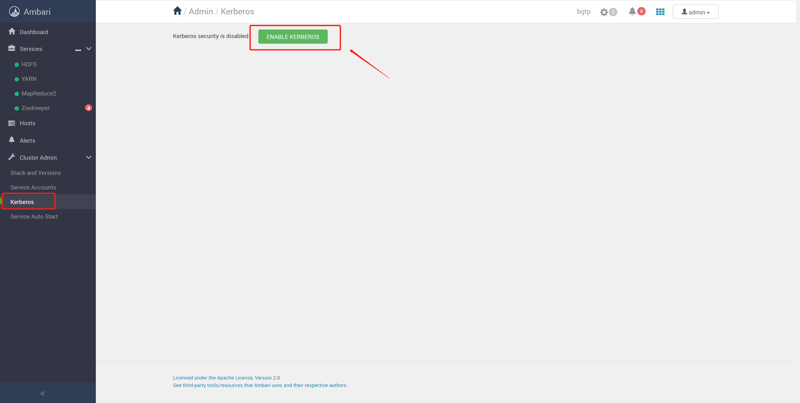
Then, enter `ENABLE KERBEROS` button.

### 2. Choose `Existing MIT KDC`
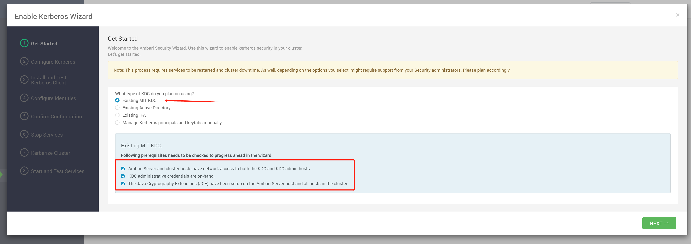
Then, enter `NEXT` button.

### 3. Fill in the KDC account password
```bash
# #############################################
#                  KDC                        #
# KDC hosts      : ambari-server              #
# Realm name     : EXAMPLE.COM                #
# #############################################
#                 Kadmin                      #
# Kadmin host    : ambari-server              #
# Admin principal: admin/admin@EXAMPLE.COM    #
# Admin password : admin                      #
# #############################################
```
Admin password is `admin`
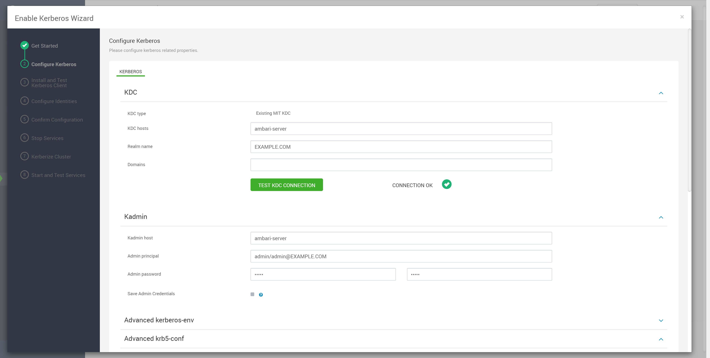

### 4. Remember to comment this line for high version of JDK 1.8

> Edit `Advanced krb5-conf` -> `krb5-conf template` -> `[libdefaults]` and comment `renew_lifetime = 7d`

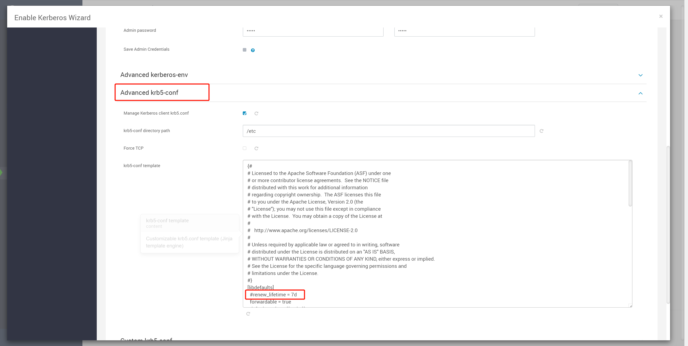
Then, enter `NEXT` button.

### 5. Install and Test Kerberos Client

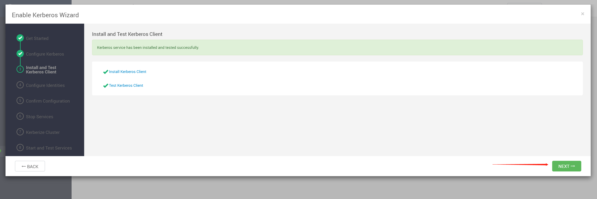
Then, enter `NEXT` button.

### 6. Check the Kerberos configuration

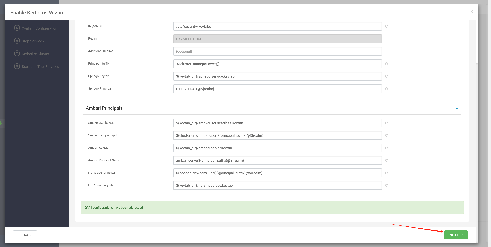
Then, enter `NEXT` button.

### 7.  Confirm Configuration

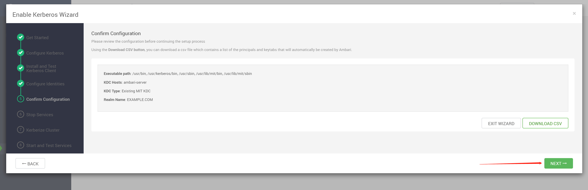
Then, enter `NEXT` button.

### 8. Stop Service

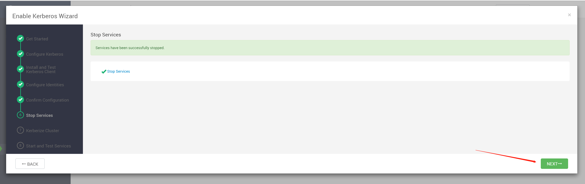
Then, enter `NEXT` button.

### 9. Kerberize Cluster

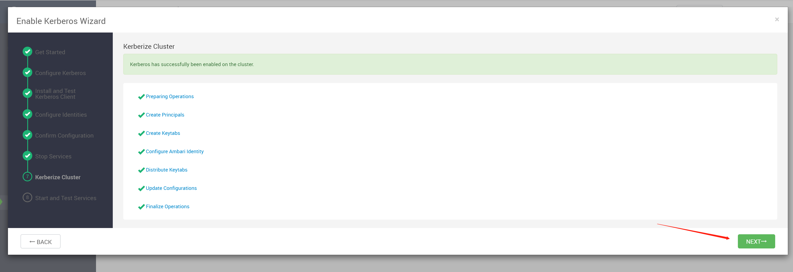
Then, enter `NEXT` button.

### 10. Start and Test Services


Then, enter `NEXT` button.

### 11. Kerberos successfully enabled
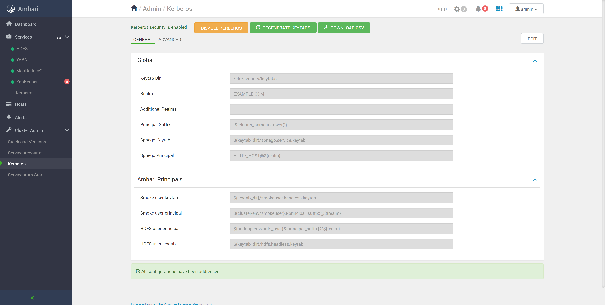
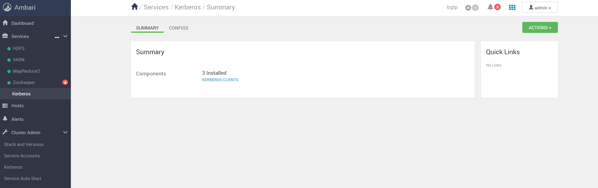